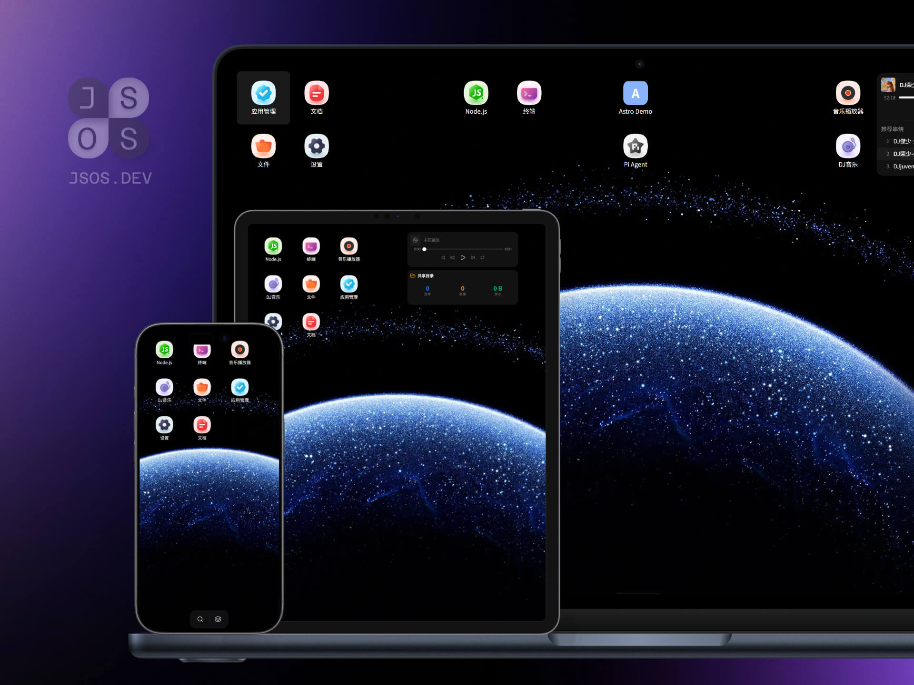

# JSOS

> A browser-based desktop environment. No backend. No database. No Docker. Just open the URL and you have a desktop.

[中文文档](README_CN.md)

---



---

## What is this?

JSOS (JavaScript OS) runs a full desktop environment in your browser — with windows, a taskbar, wallpapers, app management, and a terminal — all powered by [WebContainer](https://webcontainers.io) (in-browser Node.js). Think of it as a lightweight, self-hosted cloud desktop that lives in a single static folder.

Apps are packaged as ZIP files and run as isolated Node.js processes inside WebContainer. Install, run, uninstall — all from the browser.

---

## Deployment

JSOS is a set of static files. Deploy them anywhere that supports custom HTTP headers.

### 1. Cloudflare Pages (Recommended)

1. Fork this repository to your GitHub account.
2. Go to [Cloudflare Dashboard](https://dash.cloudflare.com/) → **Workers & Pages** → **Create** → **Pages**.
3. Connect your forked repo.
4. Build settings:
   - **Build command:** (leave empty or `echo done`)
   - **Build output directory:** `/` (root)
5. Deploy.

The `_headers` file is automatically picked up by Cloudflare Pages. No manual configuration needed.

### 2. Local

```bash
npx serve .
```

Open `http://localhost:3000` in your browser.

The included `serve.json` automatically sets the required COEP/COOP headers via `npx serve`. No extra configuration needed.

### 3. Nginx / Remote Server

Copy all files to your server and configure Nginx:

```nginx
server {
    listen 80;
    server_name your-domain.com;
    root /path/to/dist;
    index index.html;

    # Custom headers for WebContainer (CRITICAL — see below)
    add_header Cross-Origin-Embedder-Policy "require-corp" always;
    add_header Cross-Origin-Opener-Policy "same-origin" always;

    location / {
        try_files $uri $uri/ /index.html;
    }

    # Cache static assets
    location /assets/ {
        expires 1y;
        add_header Cache-Control "public, immutable";
    }
}
```

> **Warning:** Without the two `add_header` directives above, **WebContainer will not start.** The browser will silently refuse to initialize the Web Worker. You will see a blank desktop with no errors in the console. This is by design — browsers enforce Cross-Origin Isolation for security.

---

## Custom Headers — Why They Matter

WebContainer requires **Cross-Origin Isolation** to function. This is a browser security feature that isolates a page from its browser context, enabling `SharedArrayBuffer` and other low-level APIs that WebContainer depends on.

Two headers must be set on **every HTML response**:

| Header | Value | Purpose |
|--------|-------|---------|
| `Cross-Origin-Embedder-Policy` | `require-corp` | Prevents the page from loading cross-origin resources without explicit permission. Ensures all resources are loaded in the same isolated context. |
| `Cross-Origin-Opener-Policy` | `same-origin` | Isolates the browsing context from other windows/tabs. Required for `SharedArrayBuffer` support. |

**How each platform handles this:**

| Platform | Method |
|----------|--------|
| Cloudflare Pages | `public/_headers` file (automatic) |
| Netlify | `public/_headers` file (automatic) |
| Nginx | `add_header` directive |
| Apache | `.htaccess` with `Header set` |
| Any static host | Custom header injection via reverse proxy |

---

## Download

> **Note:** Currently, only the pre-built deployment package is available for download. The source code is being organized and optimized.

Upload the files to any static hosting provider and you have a working JSOS instance.

---

## Star to Open Source

This project is currently available as a deployment package only. If this repository reaches **1,000 stars**, the full source code will be released under an open-source license.

If you find JSOS useful, consider giving it a star — it helps others discover the project and brings us closer to open-sourcing.

---

## Feedback

For bug reports, feature requests, app submissions, or general discussion, please use [GitHub Issues](https://github.com/jsos-dev/jsos/issues).

---

## License

Currently: **Proprietary — deployment use only.**
